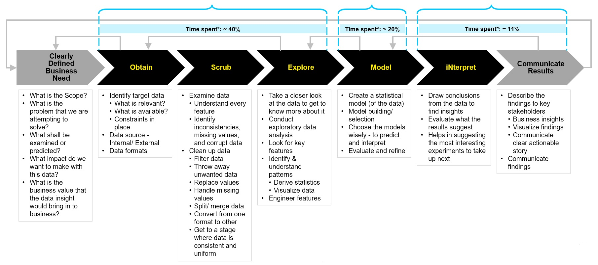

---?color=#000000
@title[Augmented Analytics?]
# Augmented Analytics

---?color=linear-gradient(180deg, black 20%, white 20%)
@title[What?]
@snap[north span-100 text-center text-bold text-white text-18]
What?
@snapend
@snap[midpoint span-100 text-center font-montserrat text-black text-08]
**What is (and, is not) Augmented Analytics?**

&nbsp;
Augmented Analytics is a new approach to problem solving that uses **artificial intelligence**, **data science**, and **machine learning** to **automate data preparation** and **discovery**, with the goal of **producing unbiased** and **optimized recommendations**
@snapend
@snap[south span-100 text-center font-montserrat text-black text-07]
@fa[quote-left](Supports humans in the decision-making process & does not replace them)@fa[quote-right]

&nbsp;

&nbsp;

@snapend

---?color=linear-gradient(180deg, black 20%, white 20%)
@title[Why?]
@snap[north span-100 text-center text-bold text-white text-18]
Why?
@snapend
@snap[midopint span-100 text-center font-montserrat text-black text-08]

&nbsp;

**Why do we need Augmented Analytics, though?**

&nbsp;
Well, many organizations have already been using (or, have implemented) analytic solutions - however, the general experience of going from **raw data to actionable insights** is a long-drawn-out, **time-consuming process** and, in order to reach the goal, one has to go through a **series** of **complex, manual steps** that has the potential to be **biased** or **error-prone** which is a challenge.
@snapend

---?color=linear-gradient(180deg, black 20%, white 20%)
@title[&nbsp;&nbsp;&nbsp;&nbsp;> Data Scientist Activities]
@snap[north span-100 text-center text-bold text-white text-14]
Typical Data Scientist Activities
@snapend
@snap[midpoint span-100]

&nbsp;

&nbsp;

@snapend

---?color=linear-gradient(180deg, black 20%, white 20%)
@title[&nbsp;&nbsp;&nbsp;&nbsp;> Current challenges...]
@snap[midpoint span-100 text-center font-montserrat text-black text-14]
Current challenges...
@snapend
@snap[east span-58 font-montserrat text-05]
- Process of going from **raw data to insights** largely remains **manual** and is extremely **time consuming**

- Business community is **inundated with huge amount of data** and it is only **getting worse**

- **Data complexity** is on the rise

- **Feature engineering** and **selection of relevant features** is typically a **complex task**

- Business users **struggle to identify the key features** that plays critical role to take best actions

- Analytics tools are evolving and are getting relatively easier to use – however, **analytics process is highly manual and prone to bias**

- Extremely **difficult for users to explore every possible combination/ pattern**

- **Shortage** of expert **data scientists**

@snapend

---?color=linear-gradient(180deg, black 25%, white 25%)
@title[How?]
@snap[north span-100 text-center text-bold text-white text-18]
How?
@snapend
@snap[south span-100 text-left font-montserrat text-black text-07]
**How do we address these challenges?**

- Use **machine-learning** and **artificial intelligence** to **automate data preparation** and **discovery**

- **Accelerate development** through use of machine-learning to automate **data preparation**, **discover insights**, **develop**, **compare**, **score** and **refine models**, and share insights

- **Automate** much of the **time-consuming** and **bias-prone tasks** while reducing the risk of missing key insights

- Enable a **business user** to play the role of **citizen data scientist**

@snapend

---?color=linear-gradient(180deg, black 25%, white 25%)
@title[When?]
@snap[north span-100 text-center text-bold text-white text-18]
When?
@snapend
@snap[midpoint span-100 text-left font-montserrat text-black text-08]
**When will DXC be ready to provide these services to clients?**

DXC's skillset readiness to offer these services to customers...
@snapend
@snap[south-east span-30 text-08]
@box[bg-green text-white rounded box-padding](Readiness # To be filled in)
@snapend

---?color=linear-gradient(180deg, black 25%, white 25%)
@title[Where?]
@snap[north span-100 text-center text-bold text-white text-18]
Where?
@snapend
@snap[midpoint span-100 text-left font-montserrat text-black text-08]
**From where will we deliver these services?**

List of DXC locations where the identified skill set is available...
@snapend
@snap[south-east span-30 text-08]
@box[bg-green text-white rounded box-padding](Locations # To be filled in)
@snapend
  
---?color=linear-gradient(180deg, black 25%, white 25%)
@title[Who?]
@snap[north span-100 text-center text-bold text-white text-18]
Who?
@snapend
@snap[midpoint span-100 text-left font-montserrat text-black text-07]
**Who is the target audience for these DXC services?**

- Potential application of augmented analytics solution is very wide
- The solutions could be applied for use cases widely across multiple industries and across various regions
@snapend

---?color=#000000
@title[Business benefits...]
@snap[midpoint span-30 text-09]
@box[bg-white text-black rounded box-padding](Benefits # <b>What's in it for the Business?</b>)
@snapend

@snap[north-east span-30 text-08]
@box[bg-green text-white waved box-padding](Data Preparation # Simplified through flexible steps)
@snapend

@snap[east span-30 text-08]
@box[bg-blue text-white waved box-padding](Data Exploration # Made much easier and intuitive)
@snapend

@snap[south-east span-30 text-08]
@box[bg-gold text-white waved box-padding](Model Creation # Simplified to enable faster iteration)
@snapend

@snap[south span-30 text-08]
@box[bg-pink text-white waved box-padding](Democratization # Enabled data literacy)
@snapend

@snap[south-west span-30 text-08]
@box[bg-green text-white waved box-padding](Self-service # Develop Citizen Data Scientists)
@snapend

@snap[west span-30 text-08]
@box[bg-blue text-white waved box-padding](Business Value # Driven by AI movement)
@snapend

@snap[north-west span-30 text-08]
@box[bg-gold text-white waved box-padding](AI Advancement # Become an AI based company)
@snapend

@snap[north span-30 text-08]
@box[bg-pink text-white waved box-padding](Bring in Efficiency # Time spent is reduced)
@snapend

---?color=linear-gradient(90deg, black 40%, white 40%)
@title[Elevator pitch...]
@snap[west span-35 text-white text-left text-14]
Elevator Pitch
@snapend
@snap[east span-58 text-center text-black font-montserrat text-05]
- DXC has many years worth of **experience in providing analytics services** to its large client base and constantly **keeps track of emerging trends** around this area

- As more organizations digitally transform, they look to **expand** the use of **data science** and **ML/AI** in order to **create** new **differentiated analytic applications**, and **embed ML/AI** into **existing applications** - however, the **scarcity** of expert data science **skills** is a significant **challenge** for them to overcome

- DXC has the capability to **implement Augmented Analytics solution** to overcome the challenges encountered by its clients

- Based on DXC's proven track record, the **clients trust DXC** in **taking them through this journey**

- This is a wonderful time for us to **tap into our capability** to **take our clients through this journey** to have a **win-win proposition**
@snapend

---?color=linear-gradient(90deg, black 35%, white 35%)
@title[Skills ...]
@snap[west span-30 text-white text-14]
Skill needs...
@snapend
@snap[north-east span-68 text-left]
##### What skills are needed to build this capability?
@snapend
@snap[east span-68 text-black text-left font-montserrat text-05]
To support the emerging paradigm, more new roles focused around data and AI are to be considered and it is critical to put in place a formal upskilling program to retrain and enhance the skills of existing people who can leverage augmented analytics capabilities, to meet the growing demand... Some of the key roles that need to be looked at are:

- **Data engineers**: A role with a main focus on curating data for further consumption

- **Citizen data scientists**: An emerging role to help fill the skills gap (between a business analyst and data scientist)

- **Developer data scientists**: A role with siginificant development effort focused on building ML and AI models to embed into applications
@snapend

---?color=linear-gradient(90deg, black 35%, white 35%)
@title[Target market...]
@snap[west span-30 text-white text-left text-14]
Target Market
@snapend
@snap[north-east span-68 text-left]
##### What is the projected market pontential?
@snapend
@snap[east span-68 text-left text-black font-montserrat text-05]
Opportunities exist across **all geographies** and across **all industry verticals** due to the nature of the problems that the client organizations are attempting to solve and as such, the market is ready to be tapped into

According to a <a href="https://www.alliedmarketresearch.com/augmented-analytics-market">report</a> by Allied Market Research, the **global** augmented analytics **market size**...
  - was valued at **~ $4B** in **2017**

  - is projected to reach **~ $29B by 2025**

  - is growing at a **CAGR** of **28.4% from 2018 to 2025**

@snapend

---?color=linear-gradient(90deg, black 35%, white 35%)
@title[Competition...]
@snap[west span-35 text-white text-left text-12]
Competition...
@snapend
@snap[north-east span-65 text-left]
##### Competition landscape...
@snapend
@snap[east span-65 font-montserrat text-left text-05]
What are our competitors doing in this space?
@snapend
@snap[south-east span-30 text-08]
@box[bg-green text-white rounded box-padding](Competition # To be filled in)
@snapend

---?color=linear-gradient(90deg, black 35%, white 35%)
@title[Expenses ...]
@snap[west span-35 text-white text-left text-12]
Expenses...
@snapend

@snap[north-east span-65 text-left]
##### Expenses towards buidling this capability?
@snapend
@snap[east span-65 font-montserrat text-left text-05]
What are the expenses that needs to be...
- identified
- planned for
  - near term
  - short term
  - long term
- tracked
@snapend
@snap[south-east span-30 text-08]
@box[bg-green text-white rounded box-padding](Expenses # To be filled in)
@snapend

---?color=linear-gradient(90deg, black 35%, white 35%)
@title[Pricing ...]
@snap[west span-35 text-white text-left text-12]
Pricing...
@snapend

@snap[north-east span-65 text-left]
##### Pricing
@snapend
@snap[east span-65 text-left font-montserrat text-05]
T-Shirt Pricing...
@snapend
@snap[south-east span-30 text-08]
@box[bg-green text-white rounded box-padding](Pricing # To be filled in)
@snapend

---?color=linear-gradient(90deg, black 35%, white 35%)
@title[Funding ...]
@snap[west span-35 text-white text-left text-11]
Commercials
(funding)...
@snapend
@snap[north-east span-65 text-left]
##### Financial ask from ORB
@snapend
@snap[east span-65 font-montserrat text-left text-05]
What is the financial ask from the ORB to build this capability
@snapend
@snap[south-east span-30 text-08]
@box[bg-green text-white rounded box-padding](Financial ask # To be filled in)
@snapend
